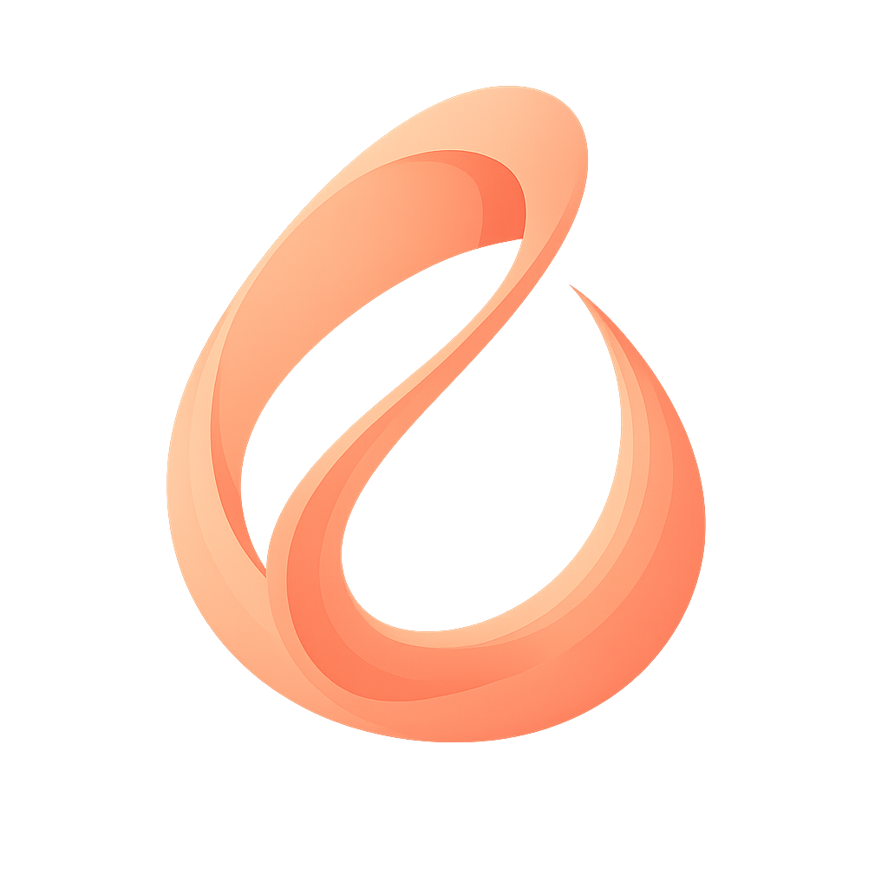

<p align="center">
  
</p>

<h1 align="center">Alba</h1>

<p align="center">
  <strong>AI-Powered Friendship Wellness for iOS</strong><br/>
  Evaluate, understand, and strengthen your friendships using psychology-backed assessments and conversational AI.
</p>

<p align="center">
  
  
  
  
  
</p>

<p align="center">
  
  
  
  
  
</p>

---

## Screenshots

<p align="center">
  
  &nbsp;&nbsp;
  
  &nbsp;&nbsp;
  
  &nbsp;&nbsp;
  
</p>

<p align="center">
  
  &nbsp;&nbsp;
  
  &nbsp;&nbsp;
  
  &nbsp;&nbsp;
  
</p>

<!-- Replace the empty src="" attributes above with your screenshot paths, e.g.:
     src="Screenshots/home.png"
     Then commit the Screenshots/ folder to the repo. -->

---

## About

**Alba** is a native iOS app designed to help people build healthier friendships through the lens of positive psychology. It is grounded in Martin Seligman's **PERMA model** — a well-established framework that measures well-being across five dimensions:

| Dimension | Focus |
|-----------|-------|
| **P**ositive Emotions | Joy, gratitude, and emotional warmth in friendships |
| **E**ngagement | Active involvement and commitment between friends |
| **R**elationships | Genuine connection, mutual support, and trust |
| **M**eaning | Purpose and shared value within the bond |
| **A**ccomplishment | Celebrating growth and pushing each other forward |

Alba combines a **15-question friendship assessment**, an **AI conversational coach** powered by Google Gemini, a **friendship journal** for tracking relationships over time, and **curated educational content** — all wrapped in a warm, glass-morphism UI that supports both English and Spanish.

---

## Features

### Friendship Assessment (Alba Test)
- 15-question evaluation across 4 key categories: **Support**, **Trust**, **Boundaries**, and **Assertiveness**
- Gender-aware question phrasing in both languages
- Scoring system (0–3 scale) with color-coded results: Strong, In Progress, or Needs Attention
- Focus area identification with personalized narrative analysis
- 30-day re-evaluation reminders to track friendship growth

### AI Chat (Alba IA)
- Conversational AI coach powered by **Google Gemini 2.5 Flash**
- PERMA-based system instructions for psychologically grounded responses
- Context-aware: automatically references your friendship journal data and test results
- Smart suggestion chips parsed from AI responses for quick replies
- Daily rate limiting with graceful warnings
- Full conversation history with past session access

### Friendship Journal
- Tracks all evaluated friendships with detailed score breakdowns
- Historical timeline showing how each friendship evolves
- Per-category trends (Support, Trust, Boundaries, Assertiveness)
- Days-since-last-evaluation tracking
- One-tap re-evaluation flow

### Alba Blocks (Educational Content)
- Curated articles on friendship psychology, boundaries, and the PERMA model
- Bilingual content loaded from bundled resources
- Clean reading experience with cover images

### Music Integration
- Apple Music search and playback via **MusicKit**
- Curated default playlist for reflective moments
- Persistent mini player across the app

### Additional
- **Sign in with Apple** for secure, privacy-first authentication
- **Bilingual support** — full English and Spanish localization
- **Dark mode** with adaptive color palette
- **Haptic feedback** patterns throughout the UI
- **Scheduled notifications** — weekly check-ins, re-evaluation reminders, and PERMA tips
- **Remote configuration** — update model, feature flags, and limits without an app update

---

## Architecture

```
Alba/
├── Models/              # Domain models (AppState, FriendshipRecord, Message, etc.)
├── ViewModels/          # MVVM state management with @Published properties
├── Views/               # SwiftUI screens organized by feature
│   ├── Onboarding/      # Splash → Intro → Sign In → Onboarding Chat
│   ├── Home/            # Main hub with animated gradient background
│   ├── Chat/            # AI conversation with Gemini
│   ├── Test/            # Friendship assessment + results
│   ├── Journal/         # Friend list + detail views
│   ├── Blocks/          # Educational articles
│   ├── Music/           # Search + mini player
│   └── Settings/        # Language, logout, data management
├── Services/            # Singleton services (API, persistence, auth, config)
├── Components/          # Reusable UI (glass buttons, avatars, gradients, tutorials)
├── Helpers/             # Design system, haptics, keychain, localization, extensions
└── Resources/           # Bundled article content (EN/ES)
```

**Pattern:** MVVM with singleton services, `@EnvironmentObject` dependency injection, and `@MainActor` concurrency isolation.

---

## Tech Stack

| Layer | Technology |
|-------|-----------|
| **UI** | SwiftUI, Combine |
| **AI** | Google Gemini API (REST) |
| **Auth** | Sign in with Apple (AuthenticationServices) |
| **Music** | MusicKit |
| **Storage** | JSON file persistence, UserDefaults, Keychain |
| **Notifications** | UNUserNotificationCenter |
| **Haptics** | UIImpactFeedbackGenerator |
| **Logging** | os.log (structured) |
| **Config** | Remote JSON config hosted on personal domain |
| **Security** | Secrets.plist (gitignored), Keychain for credentials |
| **Dependencies** | Zero third-party — 100% Apple-native frameworks |

---

## Setup

### Prerequisites
- **Xcode 26+**
- **iOS 26+ Simulator or device**
- A **Google Gemini API key** ([Get one here](https://aistudio.google.com/apikey))

### Installation

1. **Clone the repository**
   ```bash
   git clone https://github.com/arzaluz-chris/Alba.git
   cd Alba
   ```

2. **Create `Secrets.plist`** inside the `Alba/` directory:
   ```xml
   <?xml version="1.0" encoding="UTF-8"?>
   <!DOCTYPE plist PUBLIC "-//Apple//DTD PLIST 1.0//EN"
     "http://www.apple.com/DTDs/PropertyList-1.0.dtd">
   <plist version="1.0">
   <dict>
       <key>GEMINI_API_KEY</key>
       <string>YOUR_GEMINI_API_KEY_HERE</string>
   </dict>
   </plist>
   ```

3. **Open in Xcode**
   ```bash
   open Alba.xcodeproj
   ```

4. **Build and run** on an iOS 26+ simulator or device.

> **Note:** `Secrets.plist` is gitignored and will never be committed. The app will crash on launch if this file is missing.

---

## Remote Config

Alba fetches runtime configuration from a hosted JSON endpoint, allowing updates without App Store releases:

```
GET https://chrisarzaluz.dev/alba/config.json
```

```json
{
  "geminiModel": "gemini-2.5-flash",
  "maxDailyChatMessages": 50,
  "chatEnabled": true,
  "albaTestEnabled": true,
  "journalEnabled": true,
  "blocksEnabled": true
}
```

The app caches the last successful config and falls back to hardcoded defaults when offline.

---

## License

This project is proprietary software. All rights reserved.

---

<p align="center">
  Built with SwiftUI and positive psychology.<br/>
  <strong>Alba</strong> — Because every friendship deserves reflection.
</p>
